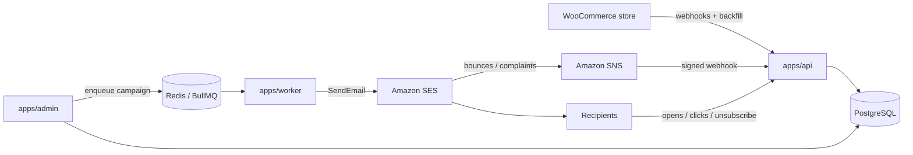

# Carnival Mailing

Self-hosted email marketing platform built for **Carnival**, a butcher shop in Barcelona with a WooCommerce online store.

It replaces a SaaS tool like Mailchimp: it syncs customers and orders from WooCommerce, lets the owner build segments ("bought product X", "no order in 60 days", "abandoned cart"), sends campaigns through **Amazon SES**, and tracks opens, clicks, bounces and unsubscribes — GDPR-compliant.

> This is a sanitized public copy of the production system. Real domains, business contact details and internal notes were removed; no credentials or customer data are included.

## Architecture



| Part | What it does |
|---|---|
| `apps/api` | Public API (Fastify): WooCommerce webhooks, SES/SNS bounce webhook, open/click tracking, one-click unsubscribe |
| `apps/worker` | Queue consumer: sends each email through SES with rate limiting, retries and suppression checks |
| `apps/admin` | Server-rendered admin UI (LAN-only): lists, templates (visual editor), segments, campaigns |
| `packages/db` | PostgreSQL schema and migrations (Drizzle ORM) |
| `packages/woocommerce` | WooCommerce REST client, webhook signature verification, data mappers |
| `packages/mailer` | SES client, SNS signature verification, SSRF guard |
| `packages/queue` | BullMQ queue and rate limiter |
| `packages/segments` | JSON rule tree compiled to safe, parameterized SQL |
| `packages/templates` | Handlebars personalization, link tracking, open pixel |
| `packages/campaigns` | Resolves a campaign's audience and enqueues the sends |
| `infra/` | Docker Compose (PostgreSQL 16, Redis 7) and Caddy with automatic TLS |

## Tech stack

Node.js · TypeScript · pnpm monorepo · Fastify · PostgreSQL · Drizzle ORM · Redis · BullMQ · Amazon SES · Amazon SNS · Handlebars · Docker · Caddy · Vitest

## Data engineering highlights

- **Ingestion:** customers and orders arrive in near real time through WooCommerce webhooks (HMAC-verified), plus a backfill script for historical data.
- **Event-driven processing:** campaign sends go through a Redis/BullMQ queue; bounce and complaint events arrive from Amazon SES via SNS.
- **Idempotency:** each send is claimed with an atomic `UPDATE`, and queue jobs use deterministic IDs, so a crash or retry never sends the same email twice.
- **Safe dynamic queries:** segments are stored as JSON rule trees and compiled to SQL through an allowlist of columns and bound parameters — user input is never interpolated into SQL.

## Security and compliance

- SNS messages are verified with AWS's RSA signature algorithm, and the topic ARN is checked.
- RFC 8058 one-click unsubscribe (required by Gmail and Yahoo since 2024), with global suppression list.
- Rate-limited admin login, constant-time password check (no timing attacks), hashed session tokens.
- Click tracking only redirects for real send tokens (no open redirect).
- AWS credentials are never stored in the repo; they come from the standard SDK credential chain.

## Getting started

Requirements: Node.js 22+, pnpm, Docker.

```bash
pnpm install
cp .env.example .env          # fill in the values
docker compose -f infra/docker-compose.yml up -d postgres redis
pnpm --filter @carnival/db migrate
pnpm --filter @carnival/api dev
pnpm --filter @carnival/worker dev
pnpm --filter @carnival/admin dev
pnpm --filter @carnival/admin createUser -- <email> <password>
```

Run the checks:

```bash
pnpm typecheck
pnpm test        # integration tests need the Postgres and Redis containers running
```

The suite has 47 test files, combining unit tests and integration tests against real PostgreSQL and Redis.

## How it was built

Solo project: I designed and built it end to end for my own business — from the requirements and architecture (after comparing Listmonk, Mautic and SendPortal) to the security audits behind the hardening above. I used **AI-assisted development (Claude Code)** as my coding tool.

## Author

**Leonardo Castillo** — Barcelona · [github.com/leocastillocastro](https://github.com/leocastillocastro)

All rights reserved. The code is shared for portfolio purposes.
